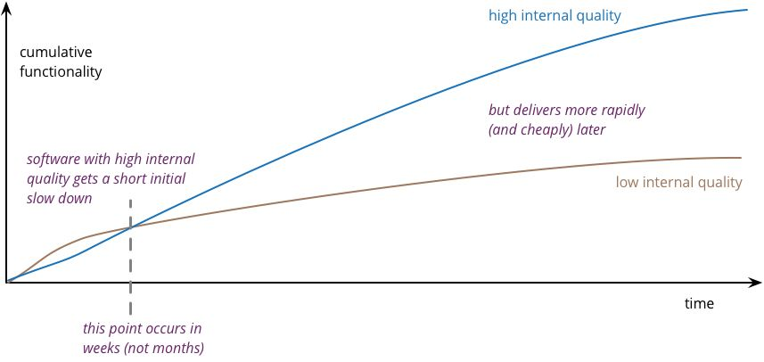

## Code Quality

💊 𝗘𝗻𝗰𝗮𝗽𝘀𝘂𝗹𝗮𝘁𝗶𝗼𝗻: No weird side effects.  

🚥 𝗜𝗱𝗶𝗼𝗺𝗮𝘁𝗶𝗰 𝗰𝗼𝗱𝗲: Uses the patterns, methods and conventions of its language.  

🏷️ 𝗠𝗲𝗮𝗻𝗶𝗻𝗴𝗳𝘂𝗹 𝗻𝗮𝗺𝗲𝘀: Variables and method names describe its purpose at a glance.  

🪑 𝗟𝗼𝘄 𝗰𝘆𝗰𝗹𝗼𝗺𝗮𝘁𝗶𝗰 𝗰𝗼𝗺𝗽𝗹𝗲𝘅𝗶𝘁𝘆: Uses the fewest decisions to do the job. Its decision tree should be easy to navigate.  
𝘕𝘖𝘛𝘌: “Cyclomatic complexity” is a metric referring to the number of decisions that exist in a process.  

🧪 𝗨𝗻𝗶𝘁 𝘁𝗲𝘀𝘁𝘀: Unit tests are more likely to accompany high-quality code than low-quality code. Devs who need to write unit tests write better code in the first place, in order to pass those tests.  

🏃 𝗗𝗲𝘃𝗲𝗹𝗼𝗽𝗲𝗱 𝗮𝘁 𝗮 𝘀𝘂𝘀𝘁𝗮𝗶𝗻𝗮𝗯𝗹𝗲 𝗽𝗮𝗰𝗲: Happiness, sufficient rest, and low stress levels are all important ingredients. Avoid overtime.  

🧧 𝗨𝗽𝘀𝗸𝗶𝗹𝗹𝗲𝗱 𝗶𝗻 𝘀𝗼𝗳𝘁𝘄𝗮𝗿𝗲 𝗲𝘀𝘁𝗶𝗺𝗮𝘁𝗶𝗼𝗻: Devs train and practice their estimation skills. Far better to negotiate for extremely generous deadlines than to end up disappointing customers.  

📋 𝗣𝗿𝗼𝗽𝗲𝗿 𝗽𝗿𝗶𝗼𝗿𝗶𝘁𝘆 𝗶𝗻 𝘂𝘀𝗲𝗿 𝘀𝘁𝗼𝗿𝗶𝗲𝘀: Build the features that are easy to build and very valuable to users first.  

🔨 𝗦𝗰𝗵𝗲𝗱𝘂𝗹𝗲𝗱 𝘁𝗶𝗺𝗲 𝗳𝗼𝗿 𝗿𝗲𝗳𝗮𝗰𝘁𝗼𝗿𝗶𝗻𝗴: Set aside a regular time for reducing technical debt. The 20% rule is a good start.  

𝘈 𝘶𝘴𝘦𝘧𝘶𝘭 𝘸𝘢𝘺 𝘵𝘰 𝘥𝘦𝘧𝘪𝘯𝘦 𝘤𝘰𝘥𝘦 𝘲𝘶𝘢𝘭𝘪𝘵𝘺 𝘪𝘴 𝘵𝘩𝘦 𝘳𝘢𝘵𝘪𝘰 𝘰𝘧 𝘣𝘢𝘥 𝘤𝘰𝘮𝘱𝘭𝘦𝘹𝘪𝘵𝘺 𝘵𝘰 𝘨𝘰𝘰𝘥 𝘤𝘰𝘮𝘱𝘭𝘦𝘹𝘪𝘵𝘺.

𝘕𝘖𝘛𝘌: Complexity that adds value or increases competitive advantage is “good complexity.”

> If team members are frequently required to check each other’s work and there are no major hostilities or communication failures between them, the quality of their collective work will rise toward the level of the most practiced programmer’s.

**References**:  
- https://stackoverflow.blog/2021/10/18/code-quality-a-concern-for-businesses-bottom-lines-and-empathetic-programmers/