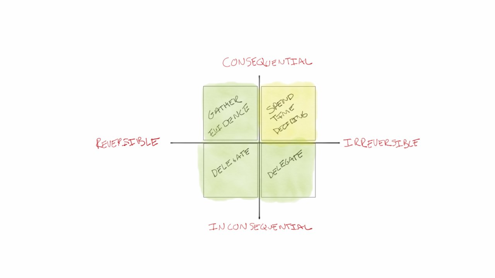
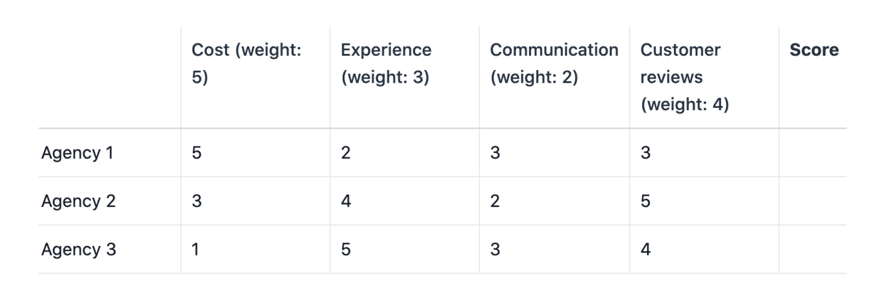
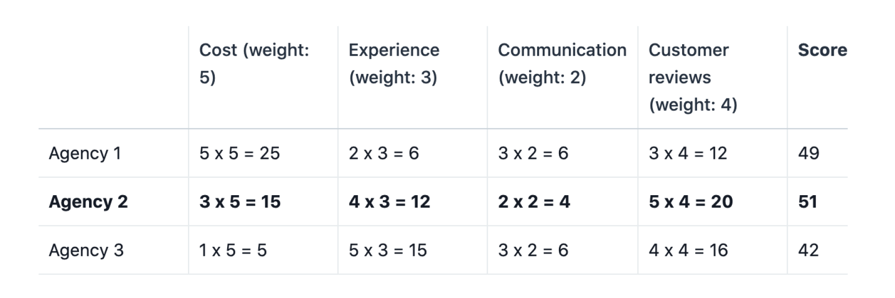

## 🔠 Decision Matrix

### Benefits

1. Reduce decision fatigue.
2. Reduce subjectivity in decision making.
3. Clarify and prioritize options.

### Delegating Decisions

1. Create a grid like this

2. For inconsequential decisions that have little or no long term impact, delegate those to juniors in the team. Ex. Choosing an emoji for a message.
3. For reversible and consequential decisions, run experiments to gather information. You can easily revert and go with a better course of action later if needed. Ex. Picking an IDE to use.
4. For irreversible and consequential decisions, take time to decide a course of action. Ex. Deciding whether to accept a new job offer or not.

### How to Use a Decision Matrix

For #3 and #4 above, you can use a decision matrix to weigh your options.

1. Along the first column, list down your options.
2. In the first row, list the most important criteria that will affect your decision.
3. Add weights to each criteria, assigning a higher rank to the more important criterion.  
4. Rank each option based on the criteria listed at the top of the column, usually using a small range like 1-5, with 5 being the best.  
     
5. Multiply the value in each cell by the weights to get the weighted score. 
6. Get the total score of each option to arrive at your decision.  
   

**References**:  
- https://fs.blog/2018/09/decision-matrix/
- https://asana.com/resources/decision-matrix-examples