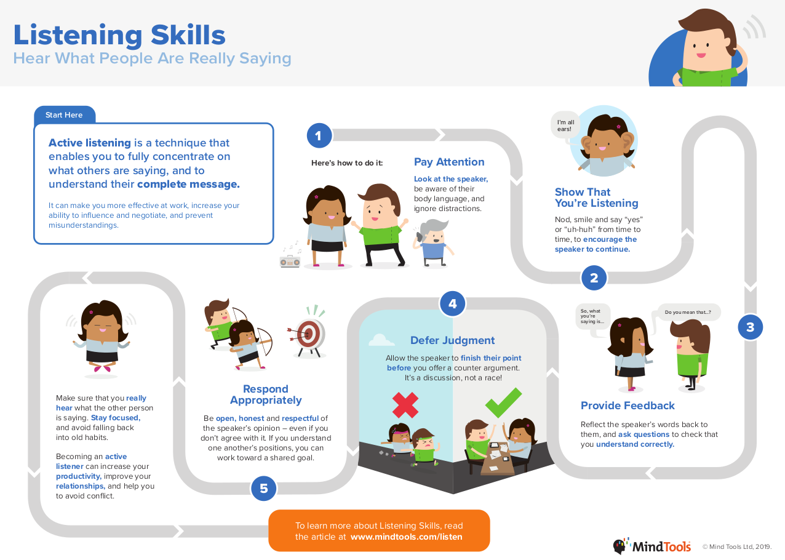
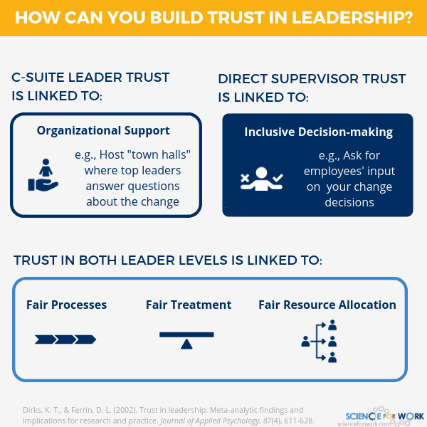

## Empathy

Empathy is the ability to recognize emotions in others, and to understand other people's perspectives on a situation. 

### 🌞 Warmth

Warmth is the measure of how likeable or trustworthy you are.

> A leader’s overall effectiveness is predicted more by warmth than competence. But a good leader will learn to convey both high competence and high warmth.

#### Benefits

1. Builds loyalty
2. Increases respect and caring from others
3. Facilitates trust and the communication and absorption of ideas

#### Cultivating Warmth

1. Make sure your actions are genuine.
2. Think carefully about how you build relationships. Think of it as as part of your job description, rather than self-promotion.
3. Communicate with honesty and authenticity.
4. Be a good listener and give others your full attention.
5. Invite and accept input and feedback from others.
6. Consider the perspective of the other party and think about what they need at that moment. Validate their feelings.
7. Be forthcoming and open. Reveal you're human and have the same fears and concerns others do. Share something personal during work conversations.
8. Practice open body language and facial expressions that convey warmth.
9. Take risks to help people out when they are in trouble.

**References**:  
- https://insight.kellogg.northwestern.edu/article/why-warmth-is-the-underappreciated-skill-leaders-need  
- https://blog.shrm.org/blog/why-warmth-matters-in-leadership  
- https://hbr.org/2013/07/connect-then-lead
- https://www.mindtools.com/pages/article/EmpathyatWork.htm

----

### 📻 Active Listening

Active listening is a valuable technique that requires the listener to thoroughly absorb, understand, respond, and retain what’s being said.

> Listening is difficult because it involves suppressing your ego long enough to consider what is being said before you respond.

*Active listening is first about understanding the other person, then about being understood as the listener.*

#### Benefits

1. Establish trust between parties
2. Fosters empathy for others
3. Encourages others to open up to you more

#### Active Listening Skills

1. Paying attention
   * Be focused on the moment. Limit distractions.
   * Operate from a place of respect as the listener.
   * Form a rich picture of the other person’s emotions and intentions.
   * Wait for the other person to finish before responding.
   * Consider waiting a few seconds before responding as well, to compose your response in a proper manner. 
   * Focus on the other person’s words, rather than thinking about what we can say next.
   * Pay attention to your body language as well as your frame of mind.
   * Make eye contact.
   * Use your own body language and gestures to show that you are engaged.
   * Be okay with silence. You don’t have to always reply or have a comment.
2. Withholding judgment
   * Be open to new ideas, new perspectives, and new possibilities.
   * Hold any criticisms and avoid interruptions.
   * Set aside biases.
3. Reflecting
   * Don't assume that you understand the speaker correctly — or that they know you've heard them. 
   * Mirror your their information and emotions by periodically paraphrasing key points.
4. Clarifying
   * Ask questions about any issue that’s ambiguous or unclear.
   * Try asking open-ended, clarifying, and probing questions.
   * Emphasize asking rather than telling.
5. Summarizing
   * Restate key themes as the conversation proceeds.
   * Briefly summarize what you’ve understood and ask the other person to do the same.
   * Restating key themes helps increase accountability.
6. Sharing
   * Begin to introduce your own ideas, feelings, and suggestions.
   * Talk about a similar experience you had.
   * Share an idea that was triggered by a comment made previously in the conversation.
   * Encourage the other person to offer ideas and solutions before you give yours.
   * Respond in an open, honest and respectful manner, even if you don't agree with the other party.

**Conversational Narcissism**
+ Rather than listening to what the other person has to say and responding accordingly, many people shift the discussion to themselves.

**Shift Response**: The respondent shifts the topic to themselves.  
**Support Response**: The respondent sustains the speaker’s words and encourage them.

> Prefer giving support responses over shift responses

#### How To Improve Active Listening

1. Educate yourself on common cognitive biases and shortcuts. 
2. Allow the other person time to finish speaking, then provide a considered response.
3. Aim to make liberal use of 'you' instead of 'I' or 'me'.
4. Take notes during key conversations, like 1:1s, professional appointments, and work meetings.
5. Seek to develop a clear picture of the other person’s logic.
6. Accept their assumptions for the time being – accepting them to discern their consequences, to see how they lead to the conclusions he wishes to arrive at.
7. Know your motivation for listening. This motivation might be the desire to improve a relationship, follow instructions without wasting time, make someone feel better or to make an exchange as clear as possible.

**References**:  
- https://fs.blog/2017/07/active-listening/  
- https://www.ccl.org/articles/leading-effectively-articles/coaching-others-use-active-listening-skills/  
- https://www.mindtools.com/CommSkll/ActiveListening.htm

----

### 🎗️ Trust

> Employees expect their leaders to treat them well, and, as a consequence, are comfortable being open with their leaders.

#### Two Types of Trust

* **Cognitive trust** is primarily how confident someone feels in the leader's technical ability to do the job.
* **Affective trust**, known as 'trust of the heart', is characterised by feelings of security and perceived strength of the relationship, as well as the degree to which we think someone's intentions are trustworthy, their ethics sound and their integrity whole.

#### Benefits

1. Increases team happiness
2. Instills psychological safety
3. Improves collaboration since people become more open

#### Trusting Others

+ The leader lacking in trust is unable to form effective relationships and functional teams. 
+ When a leader is not discerning enough in his trust of others, blind spots flourish and, paradoxically, people in the organization feel unsafe.

#### Building Trust

1. Reinforce the big picture. This helps reorient people to the grand plan and your way of thinking, preventing them from focusing too narrowly on your individual actions or ideas.
2. Aim for transparency to build cognitive trust so your team gets constant reinforcement that you are tackling technical tasks proactively.
3. Adopt a continuous learning mindset through constant curiosity.
4. Be consistent in your actions so people know where they stand with regards to your directives.
5. Build time for connection and bonding outside of work.
6. Ask questions and show an interest in team mates as individuals helps you share knowledge and break down barriers. 
7. Respond to queries and questions in human ways, rather than going straight to set policies.
8. Let your guard down and share vulnerabilities.
9.  Treat people fairly and explain the appropriate rationale behind business decisions and directives.
10. Allocate resources fairly and do not play favorites.
11. Involve the team in decision making.

**References**:  
- https://www.forbes.com/sites/prudygourguechon/2018/02/20/why-inspiring-trust-and-trusting-others-are-essential-leadership-capacities-within-bounds/  
- https://www.investorsinpeople.com/knowledge/leadership-skills-trust/
- https://scienceforwork.com/blog/trust-in-leadership-change/
- https://www.betterup.com/blog/leadership-trust