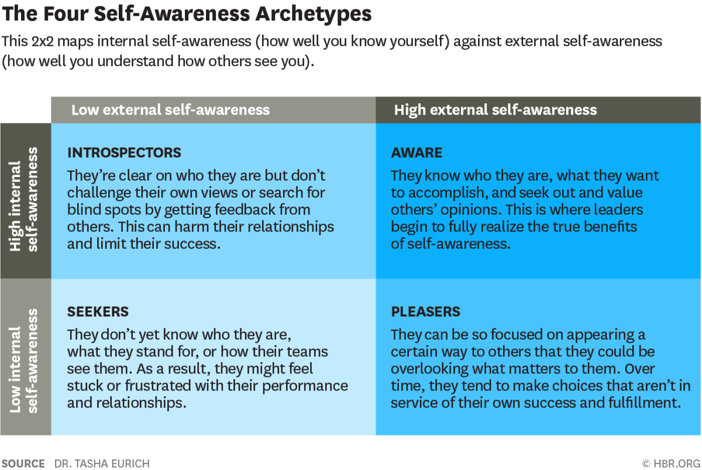

## Leadership Qualities

I'm highlighting these qualities since I believe becoming a successful leader requires all of these traits.

----

### 🌌 Self-Awareness

There's internal self-awareness: how clearly you see your own values, passions, aspirations, fit with our environment, reactions (including thoughts, feelings, behaviors, strengths, and weaknesses), and impact on others. 

There's also external self-awareness: understanding how other people view you, in terms of those same factors listed above.

#### Benefits

* Increases confidence
* Increases creativity
* Enables better decision making
* Enables better communication

#### Recommended Activities

1. Seek frequent critical feedback from your bosses, same-level peers, team.
2. Seek feedback from loving critics, people who can be honest with you and have your best interests in mind.
3. Cross-check any difficult or surprising feedback you get with other people.
4. Keep an open mind with regards to the feedback you receive.
5. Write down your core values so you know what drives your decisions.
6. Communicate these values to your direct reports.
7. Adjust your behavior based on your self-assessments and feedback from others.
8. Instead of asking yourself "why" and rationalizing an action, ask yourself "what" so you can be objective and more solution-oriented.
   + ex. Instead of asking yourself, "Why did I say that?", instead ask "What could have I said instead?"

**References**:  
- https://hbr.org/2018/01/what-self-awareness-really-is-and-how-to-cultivate-it  
- https://fisher.osu.edu/blogs/leadreadtoday/blog/become-an-authentic-leader-be-self-aware  

----

### 🔎 Transparency

Transparency means you have open and honest communications with your team.

#### Benefits

* Improves communication skills
* Increases happiness and productivity
* Builds stronger bonds with team mates

#### Recommended Activities

1. Initiate open conversations by first sharing things about yourself so that others are encouraged to do the same.
2. Recount a failed decision and what you learned from it.
3. Encourage a culture that does not punish people for bringing up failures.  
4. Host AskMeAnything sessions so the team can get to know you better.
5. Avoid sugar coating bad news.
6. Be straightforward while still being kind.
7. When talking about decisions you've made, also share the reasons behind it.
8. Make information easily accessible to every team member. It should be visible and well as easy to find.

**References**:  
- https://www.atlassian.com/blog/confluence/5-ways-create-transparency-at-work  
- https://front.com/blog/8-examples-of-transparent-leaders-to-follow  
- https://buffer.com/transparency  
- https://about.gitlab.com/handbook/values/#transparency  

----

### 💔 Vulnerability

Vulnerability means embracing failure and humbly sharing our emotional state during times of uncertainty, risk, and emotional exposure. 

#### Benefits

* Increases trust with your team
* Builds up your courage
* Reduces stressors caused by keeping up an "image"
* Facilitates free flow of ideas

#### Recommended Activities

1. Review your strengths and weaknesses and share them with the team.
2. Be honest with others regarding the challenges you're struggling with.
3. Humbly admit when you're wrong or when you don't know something. Don't make excuses and don't explain.
4. Ask for help even when you feel like it exposes your weakness to the team.
5. Foster a culture of [psychological safety](https://en.wikipedia.org/wiki/Psychological_safety) within the team.
6. Don't get upset when someone makes a mistake. Instead, give them time to fix it.
7. Open up about your emotional state so the other person can do so too.
8. Avoid interrupting people, as well as any type of hostility including sarcasm and passive agression.
9. Make it easy for them to reach out to you. Answer calls, respond quickly to chats, and reply without judgment.

**References**:  
- https://www.cultureamp.com/blog/brene-brown-vulnerability-and-leadership  
- https://learn.g2.com/vulnerable-leadership  
- https://hbr.org/2014/12/what-bosses-gain-by-being-vulnerable  
- https://www.mindstrength.com.au/blog/the-importance-of-showing-vulnerability-as-a-leader

----

### 💼 Ownership

Ownership means taking responsibility for outcomes and being empowered to make the decisions that will lead to those outcomes.

#### Benefits

* Increases self-esteem and confidence in abilities
* Builds better relationships with team
* Speeds up execution on corrective actions
* Fosters learning for both you and others in the team
* Instills a growth mindset

#### Recommended Activities

1. Shift from a project to a product mindset.
2. Be proactive in finding and solving problems.  
3. Dig deep into yourself and reconnect your core values to your work.
4. Look at problems as opportunities to improve.
5. Talk with the users of your product. Understand their problems.
6. Define a mission statement for your role and share your mission widely. 
7. Recognize that every day offers a series of great opportunities to make a positive impact on those around you.  
8. Teach others in your team and help them grow.

**References**:  
- https://hbr.org/2012/08/take-ownership-of-your-actions  
- https://www.thebalancecareers.com/how-to-take-ownership-of-your-job-2276185

----

### 🥊 Resilience

Resilience is the ability to recover and adapt quickly from a traumatic event or stressor, a kind of inner strength. Resilient people often have a consistently positive outlook, deal with each difficult situation they face with ease, and don’t exhibit excessive negative emotions during difficult times.

#### Benefits

* Improves ability to handle stress
* Lets you function well and thrive during times of crisis
* Improves your effectiveness at work
* Reduces stress levels
* Prevents burnout

#### Recommended Activities

1. Do the work and give it your best, but do not worry about the outcome.
2. Exercise compassion for yourself and others.  
3. Look back to your life purpose, or craft one if you haven't already. Use that as your guiding light during the crisis.
4. Pay attention to your health. Sleep 7-8 hours, eat healthy foods, exercise regularly, and so on.
5. Figure out who and what pushes your buttons. Step away, slow down, or enlist an ally to help you control your reactions and choose your response. 
6. Keep a journal of your experiences to build self-awareness, encourage learning, and open the door to adaptability.
7. Cultivate relationships with family, trusted friends and colleagues. They will be your source of stregth and guidance during trying times.
8. Approach adversity with a positive outlook and without harsh self-criticism. Recognize negative emotions but don't wallow in them.
9. Practice reframing threats as challenges that will help you grow.
10. Aim to identify how you feel and act when you’re stressed and what helps you to de-stress, so that you can catch yourself before you spiral.
11. [Assume positive intent](https://collaborativeway.com/general/a-ceos-advice-assume-positive-intent/).

**References**:  
- https://www.betterup.com/blog/how-to-build-resilience-why-resilience-is-a-top-skill-for-the-workplace
- https://www.ccl.org/articles/leading-effectively-articles/leadership-resiliency-handling-stress-uncertainty-and-setbacks/  
- https://online.hbs.edu/blog/post/resilient-leadership  

