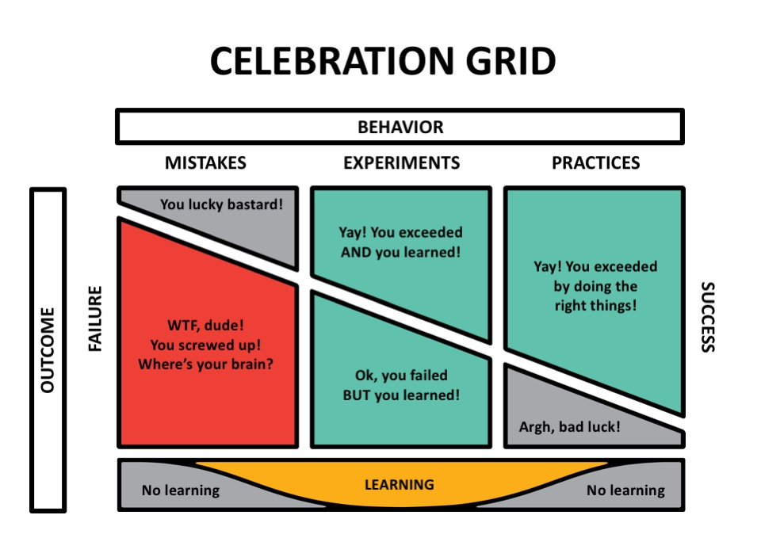

## ⤴️ Managing Upwards

**Managing Up** is defined as cultivating a trusting relationship upwards towards your supervisor in the hierarchy. Managing up is not an event — it's an ongoing process that, when done right, can be very rewarding. Treat it as an investment, not an overhead.

> *“Managing up” prevents the team from experiencing excessive “Managing down”.*

### Benefits

1. Increases autonomy at work.
2. Multiplies your chances of career advancement.
3. Reduces friction at work.

### Practical Tips

1. Communicate your intent to your managers and colleagues. Spend about 80% time on clarifying your intent, and the remaining 20% on discussing the next action to take. Once the intent and objectives are clarified, add some metrics as a way to measuring progress.
   * Ensure that your own OKRs and actions help your managers achieve theirs.

> Anything sufficiently complex or abstract takes multiple exposures (in his case, seven) in order for someone to internalize the concept.

2. Discuss expectations with your manager and other team members on how you think it would be best to make a specific decision. Gain clarity on what decisions you have full authority to take without needing to consult your manager.
   * The intersection of your success and your manager's success is where magic happens, and where your opportunities for fulfilling impact lie.
3. Understand your manager's most urgent priorities, and then adjust accordingly. Overcommunicate if you're working on their top priority, drop back and keep working well otherwise.
   * Anticipate their needs and identify things you can take off their plate. There’s nothing managers hate more than surprises.
4. Give and ask for feedback. Most people exchange feedback because they care about the other person and the collective desired outcomes. 
   * Ask for feedback on your specific personal and professional development areas, and by this you are creating opportunities for vulnerability and trusting, helpful relationships.
5. Learn how your leader processes inputs. Tailor the information you share based on the person’s priorities and preferred style. If you must disagree, do so respectfully while outlining your reasons clearly.
6. Show [vulnerability](https://github.com/glennsantos/senior-developer-roadmap/blob/main/leadership/leadership-qualities.md#-vulnerability). Rather than trying to look competent in any situation and in any domain, [be transparent](https://github.com/glennsantos/senior-developer-roadmap/blob/main/leadership/leadership-qualities.md#-transparency) when you don't know how to approach a problem and communicate about what experiments you will run to find out more information.
   * By sharing personal challenges and exchanging help, you can develop a strong supportive bond with your manager and colleagues.

7. Always deliver on your commitments. If any time we discover that meeting our earlier commitment is not possible, we should ask for help and form new agreements in due time to minimize impact on the outcome.
8. Set up 1:1s with them to align expectation, overcome challenges, and build rapport. Creating a shared doc ahead of time helps.
9. Treat your manager as a person. Cultivating a sense of curiosity and [emotional empathy](https://github.com/glennsantos/senior-developer-roadmap/blob/main/leadership/empathy.md) with your boss can help develop a relationship which goes beyond the daily tasks and can help both of you to mutually develop into a better human being.

**References**:  
- https://management30.com/blog/managing-up/
- https://review.firstround.com/a-tactical-guide-to-managing-up-30-tips-from-the-smartest-people-we-know