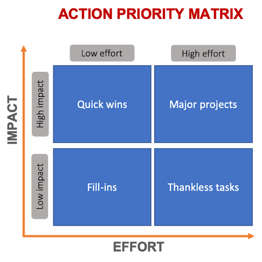

𝗧𝗵𝗲 𝗔𝗰𝘁𝗶𝗼𝗻 𝗣𝗿𝗶𝗼𝗿𝗶𝘁𝘆 𝗠𝗮𝘁𝗿𝗶𝘅 🏆

* A diagram that shows you which tasks to focus on, and in which order.

People typically classify these boxes as follows:  
🏰 **Quick Wins** (high impact, low effort) - Gives the best return for effort.  
🏔️ **Major Projects** (high impact, high effort) - Gives good returns, but they are time-consuming.  
⛺ **Fill-ins** (low impact, low effort) - Drop them or delegate.  
🏚️ **Thankless Tasks** (low impact, high effort) - Avoid these activities.  

## Tips:
1. Plan ahead for major projects so you can make progress on them. Alternatively, you can slice these up into smaller quick wins.
2. Whether they are quick wins or major projects, focus on the work that will provide the greatest return versus the effort. This might mean foregoing some quick wins over getting major projects started as soon as possible.

  
*image courtesy of Product Plan blog*

References:
- https://www.productplan.com/glossary/action-priority-matrix/
- https://www.mindtools.com/pages/article/newHTE_95.htm